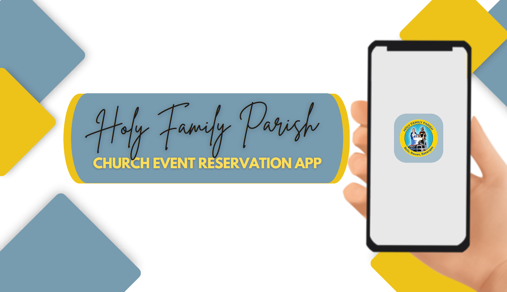
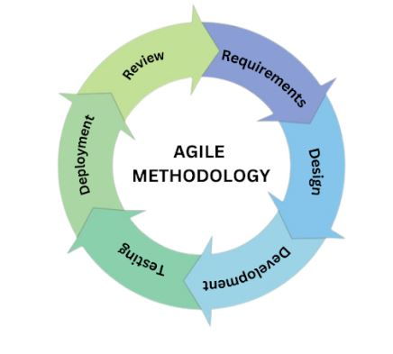

  

<h1 align="center"> Holy Family Parish Church Event Reservation App in Bolo, Bauan, Batangas </h1>

## Brief Description of the Project

&nbsp;&nbsp;&nbsp;&nbsp; Holy Family Parish is a Roman Catholic Church located in Balintawak Street, Brgy. Bolo, Bauan, Batangas which are currently experiencing numerous in-person event reservations such as infant and adult baptism, first holy communion, confirmation, confession, marriage, other milestones like birthday, wedding anniversary and funeral ceremony. With their traditional manual method, the process of reserving a church event is very time-consuming and involves physical contact with others. These significant challenges can easily be solved by utilizing modern technology.

&nbsp;&nbsp;&nbsp;&nbsp; Holy Family Parish app is a mobile web application that allows the user to reserve for a specific church event. Also, to organize and manage schedule of events while providing security and accuracy of information for all the user. The ultimate goal is to bridge the gap through a mobile web application by enhancing their current church operations to accommodate the needs of the congregation including numerous event reservations and other services.

**Sustainable Development Goal (SDG) - Goal 17: Partnerships for the Goals**

  

&nbsp;&nbsp;&nbsp;&nbsp; This project will be based on Sustainable Development Goal (SDG) 17, “Partnerships for the Goals”, which calls for a global partnership for sustainable development. Furthermore, SDG 17 emphasises the importance of access to science, technology and innovation, in particular internet-based information and communications technology. The project seeks to contribute to the achievement of SDG 17 by developing a mobile web application that is user-friendly, accurate and efficient to enhance and streamline the church operations by providing them with an easy and convenient way to access the church’s services virtually.

## Development Model

  

&nbsp;&nbsp;&nbsp;&nbsp; The programmers employed the agile methodology to create the application, which demonstrate the system's development process.  Agile methodology is a software development model that emphasizes flexibility and collaboration between cross-functional teams. The implementation of agile methodology in church mobile application  can significantly improve the efficiency and effectiveness of church operations. The methodology was divided into several parts to be passed through sequentially. Starting with the requirement , design, development, testing, deployment, and  review.

**REQUIREMENTS**

&nbsp;&nbsp;&nbsp;&nbsp; It is the initial phase that requirements understanding of the function and ensuring that it has value, as well as gathering the expected data to be seen in the mobile application. The proposed project should include the necessary specifications that the developers may utilize to create the application, including the necessary programming languages, designs, functionalities to produce the desired results.

**DESIGN**

&nbsp;&nbsp;&nbsp;&nbsp; The system was designed in this spot. It is the specification document that was developed to outline the design's technical needs. As advocates work to improve mobile application  interfaces, they explore how to design them while keeping the requirements in mind.

**DEVELOPMENT**

&nbsp;&nbsp;&nbsp;&nbsp; Which as per the design produce the code and combine the codes for the next phase. It is where the system's supporters begin to construct it. Additionally, this process emphasizes the development of the proposed application time by time.

**TESTING**

&nbsp;&nbsp;&nbsp;&nbsp; It is where the proponents integrate and test the unit tested code to ensure that it performs as planned. Its purpose is to guarantee that every component of the mobile application  is responsive and performs the desired functions. It is the stage at which the problems of the system are discovered, as well as whether the product satisfies the desired output.

**DEPLOYMENT**

&nbsp;&nbsp;&nbsp;&nbsp; Once the project team has tested the application and determined that it has successfully completed each testing step, including functional and non-functional testing, the system is prepared for implementation in a real-world environment.

**REVIEW**

&nbsp;&nbsp;&nbsp;&nbsp; When the application is finished, the developers need to have a testing process in place for the application integration to monitor for potential problems and to determine the aid users, bugs and flaws will be examined and fixed.

## System Architecture

**SEQUENCE DIAGRAM**

  

**USE CASE DIAGRAM**

  

## Application Screenshot

  

  

  

  

  

  

  

  

  

  

  

  

  

  

  

  

  

  

  

  

  

  

  

  

  

  

## Team Members

  

- *Makalintal, Larah Dienice D.*
- *Medrano, Ma. Lea Jane D.*
- *Panganiban, Glenn P.*
- IT-BA-3304
